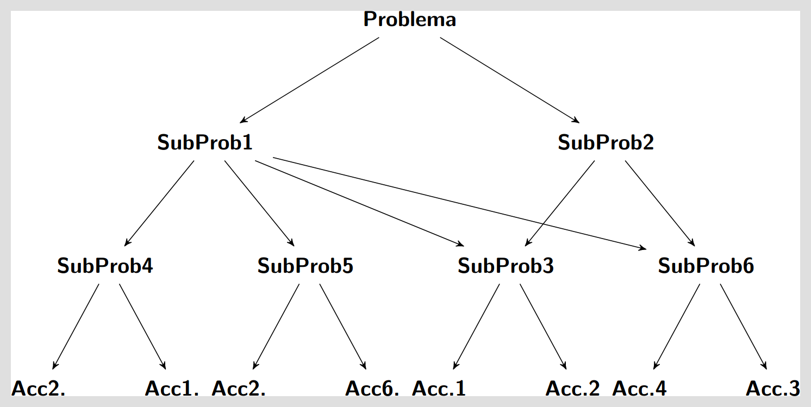
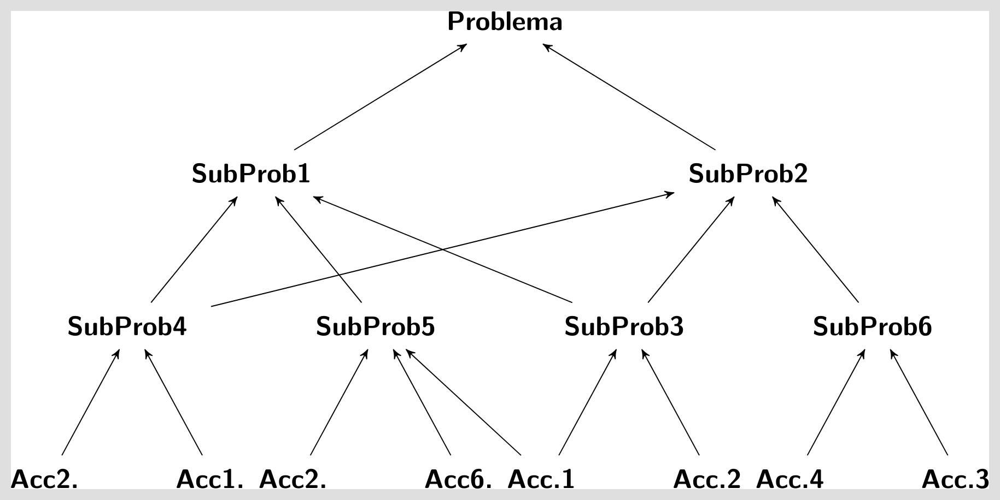

# Divide et impera

Hace ya miles de años los romanos habían comprendido que una estrategia efectiva que podía ser
aplicada a la política y a la guerra se plasmaba en la frase "Divide et impera" (Divide y vencerás),
la autoría de la misma se le otorga al emperados romano Julio César. El concepta básico detrás de
esta frase es la siguiente: esta técnica permite a un poder central compuesto por un número
relativamente pequeño de personas, gobernar y dominar a una población mucho más numerosa, y de una
forma relativamente simple.

Esta idea puede ser utilizada también como técnica de resolución de problemas. Dado un determinado
problema complejo de resolver, la idea detrás de "divide et impera" implica que la resolución del
mismo se obtiene dividiendo el problema inicial en partes (o subproblemas) más simples tantas veces
como sea necesario, hasta que la solución de cada una de las partes sea obvia. Una vez encontrada la
solución de cada una de las partes (o subproblema) el problema inicial queda resuelto por la
composición o combinación de la solución de cada una de las partes.  

Este método de resolución de problemas puede ser descrito como un algoritmo.

## Programación Top-down

Esta técnica de programación conocida como top-down (descendente) basa la construcción de un
programa a partir de una especificación general o de alto nivel de lo que el mismo debe hacer,
posteriormente se descompone esta especificación en piezas más y más sencillas hasta alcanzar un
nivel que corresponda a las **acciones primitivas** del lenguaje en el cual se implementará el
programa. Una **acción primitiva**, es \emph{toda aquella acción que puede ejecutarse sin
necesidad de algún tipo de explicación para aquel que la ejecuta}. Se debe tener en cuenta que una
acción primitiva en un lenguaje de programación, puede no serlo en otro. 

Básicamente es el concepto propuesto por César en la frase "divide et impera":

Esta técnica de programación sustenta sus principios en:

1. La descromposición o la partición.
2. Los refinamientos sucesivos.

Uno de los promotores de esta técnica fue Niklaus E. Wirth, y la plasmó en el artículo Program
Development by Stepwise Refinement.

Desventajas:
1. Complica la realización de pruebas.
2. El programa ejecutable completo se obtiene muy al final del proceso de desarrollo.
2. Tiende a tgenerar una partición del problema muy específica y relacionada a ese caso en
   particular.

## Programación Bottom-up

La programación Bottom-up o ascendente por el contrario es una técnica de programación que a partir
de **acciones primitivas** del lenguaje construye poco a poco acciones cada vez más complejas hasta
llegar a obtener todas las necesarias para la construcción del programa:

Este tipo de técnica se utilizará hacie el final de la materia y se continuará profundizando en los
cursos posteriores de programación.

Esta técnica de programación sustenta sus principioes en:
1. La composición.
2. En el concepto de "hágalo usted mismo!" (ej: un mueble comprado en un supermercado).

Desventajas:
1. Es necesario tener una buena cantidad de partes ya construidas.
